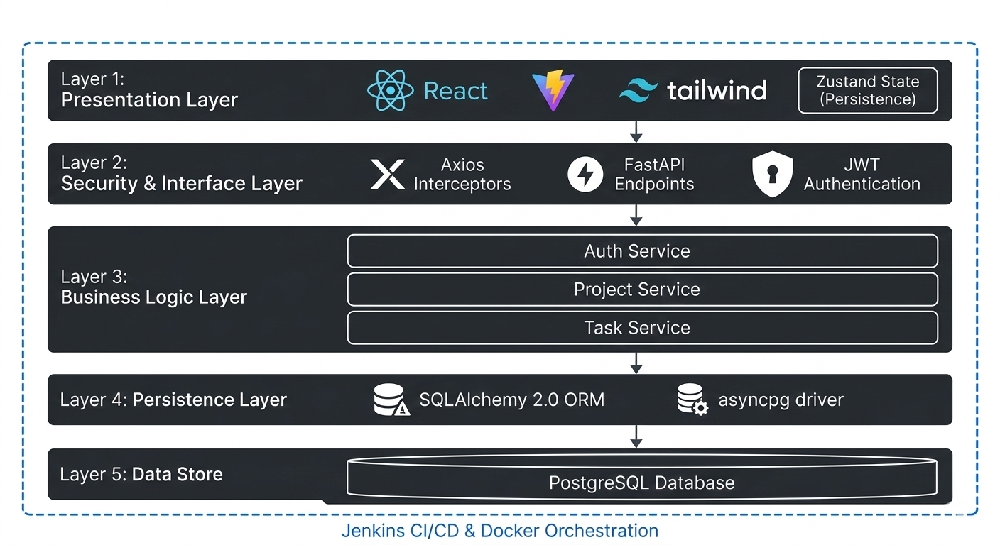

# Frontend Architecture Overview

## Design Principles
The frontend is built as a **Decoupled Single Page Application (SPA)** that interacts with the backend via a secure REST API.

### Key Architectural Patterns:
- **Feature-Based Module System**: Code is organized by "Features" (e.g., `features/auth`, `features/projects`). Each feature contains its own logic, API calls, and local components.
- **Stateless/Stateful Separation**: UI components are mostly functional and stateless, with state being centralized in **Zustand** stores.
- **Client-Side Persistence**: Authentication tokens and user profiles are persisted to `localStorage` using the Zustand `persist` middleware, allowing sessions to survive page refreshes.
- **Client-Side Security**: JWT tokens are stored securely and injected into every request via **Axios Interceptors**.

## The Presentation Layer (Layer 1 in N-Tier)
The frontend serves as the top-most layer of the system architecture.

### Technology Choices & Justification
- **Vite**: Chosen for near-instant HMR (Hot Module Replacement) and optimized production builds.
- **Zustand**: A lightweight alternative to Redux that provides a simpler API for global state without the boilerplate.
- **Tailwind CSS**: Ensures high-fidelity design with consistent spacing and color tokens.
- **React Query**: Handles server state synchronization, caching, and background refetching automatically.

## Integration Layer
- **Environment Driven**: API endpoints are injected at build time using `.env` files, making the same codebase portable across Staging and Production via Jenkins.
